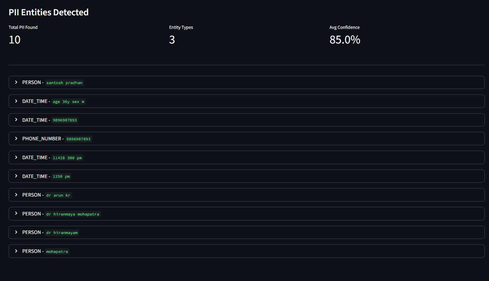
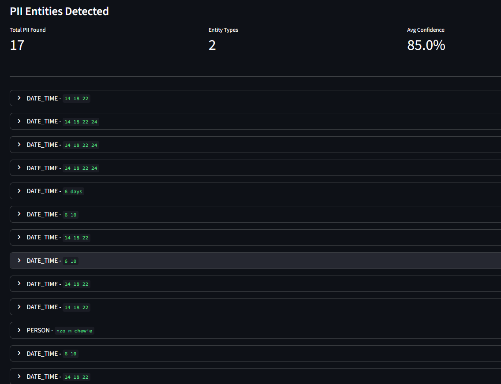

# Document-PII-Extraction


## Installation
```
uv init
uv venv
.venv\Scripts\activate
uv add -r requirements.txt
```

## Insall spacy
```
uv run python -m ensurepip --upgrade
uv run python -m pip install --upgrade pip
uv run python -m pip --version
uv run python -m spacy download en_core_web_lg
```


## Run
```
streamlit run main.py
```

## Recommendation 
 - Use Gemini model for the better result
 - tesseract ocr is not performing good


(Optional) Add GOOGLE_API_KEY in .env file


## Results
```
page_30.jpg

### Raw Text
INSTITUTE OF MEDICAL SCIENCES & SUM HOSPITAL
(Faculty of Medical Sciences)
SIKSHA 'O' ANUSANDHAN
(DEEMED TO BE UNIVERSITY)
K-8, Kalinga Nagar, Bhubaneswar
PROGRESS REPORT

L.P. No.
PLAN OF CARE

→ CIWA-M
→ MAT

Patient Name: Santosh Pradhan Age: 36y Sex: M
IPD No. 9896-987893 UHID No. 94110195 Dept: W-1 Bed No: 10

DATE & TIME
PROGRESS NOTES
TREATMENT/ADVICE

Restraints
Y
N
Investigation Advised
Type
Reason
CBC

11/4/28
3:00 pm
patient received from OPD to Ward-1
on date 11/4/23 time 12:50 PM

KFT
LFT
S. Electrolytes
HH
ECG
Samylase / S-lipase
GGT
T3T4TSH
PPBS IFBS
→ NCCT Brain
UDS

1) Inj THIAMINE (200) T
100 ml NS TID
2) Inj. LOPAZ (1 amp) slow
IV TDS and SOS
3) Inj. PAN (40) 1 vial I.V. OD
B/D
4) TAB TAXIM-O (200) 1 TAB BD

D1. MENTAL & BEHAVIOURAL DISORDER DUE TO
USE OF ALCOHOL, DEPENDENCE SYNDROME
CURRENTLY TAKING THE SUBSTANCE (F10.24 + F17.29)

Vitals
BP →
PR →
RR →
Temp →

R
1) Inj THIAMINE (200) in
100 ml NS TID
2) Inj LOPEZ (1amp) slow
IV TDS SOS
3) Inj PAN (40) 1 vial IV OD
B/D
4) TAB. TAXIM-0 (200)
1 tab BD

Diet
Consistency Normal Soft Liquid Tube Feeds Fasting
Type Normal Diabetic Low salt Other

Preventive Care
PG Resident
Dept of Psychiatry
IMS & SUM Hospital

References
Resident Signature
Full Name: DR. ARUN KR
Mobile No: PRUMAR
Date
Time

(Contd.)

Dr. Hiranmaya Mohapatra
Professor, Dept of Psychiatry
Regd No-18427 OSBN
IMS & SUM Hospital, BBSR
Consultant Signature
Full Name: DR. HIRANMAYAM
Mobile No: MOHAPATRA
Date:
Time:

### Cleaned Text
institute of medical sciences  sum hospital faculty of medical sciences siksha o anusandhan deemed to be university k8 kalinga nagar bhubaneswar progress report lp no plan of care  ciwam  mat patient name santosh pradhan age 36y sex m ipd no 9896987893 uhid no 94110195 dept w1 bed no 10 date  time progress notes treatmentadvice restraints y n investigation advised type reason cbc 11428 300 pm patient received from opd to ward1 on date 11423 time 1250 pm kft lft s electrolytes hh ecg samylase  slipase ggt t3t4tsh ppbs ifbs  ncct brain uds 1 inj thiamine 200 t 100 ml ns tid 2 inj lopaz 1 amp slow iv tds and sos 3 inj pan 40 1 vial iv od bd 4 tab taximo 200 1 tab bd d1 mental  behavioural disorder due to use of alcohol dependence syndrome currently taking the substance f1024  f1729 vitals bp  pr  rr  temp  r 1 inj thiamine 200 in 100 ml ns tid 2 inj lopez 1amp slow iv tds sos 3 inj pan 40 1 vial iv od bd 4 tab taxim0 200 1 tab bd diet consistency normal soft liquid tube feeds fasting type normal diabetic low salt other preventive care pg resident dept of psychiatry ims  sum hospital references resident signature full name dr arun kr mobile no prumar date time contd dr hiranmaya mohapatra professor dept of psychiatry regd no18427 osbn ims  sum hospital bbsr consultant signature full name dr hiranmayam mobile no mohapatra date time


```



### page_14.jpg
```
### Raw text
Other Direction
Signature
Other Direction
Signature
Other Direction
Signature
Other Direction
Signature

                                                                                                                    6        10       14       18       22       24
                                                                                                                   (illegible circle/mark)   X         X         X         X         X
                                                                                                                   (illegible circle/mark)   (illegible mark) (illegible mark) (illegible mark) (illegible mark) (illegible mark)
                                                                                                                   (illegible circle/mark)   X         X         X         X         X
                                                                                                                   (illegible circle/mark)   (illegible mark) (illegible mark) (illegible mark) (illegible mark) (illegible mark)
                                                                                                                   (illegible circle/mark)   X         X         X         X         X
                                                                                                                   (illegible circle/mark)   (illegible mark) (illegible mark) (illegible mark) (illegible mark) (illegible mark)
                                                                                                                   (illegible circle/mark)   X         X         X         X         X
                                                                                                                   (illegible circle/mark)   (illegible mark) (illegible mark) (illegible mark) (illegible mark) (illegible mark)
                                                                                                                   (illegible circle/mark)   X         X         X         X         X
                                                                                                                   (illegible circle/mark)   (illegible mark) (illegible mark) (illegible mark) (illegible mark) (illegible mark)
                                                                                                                   (illegible circle/mark)   X         X         X         X         X
                                                                                                                   (illegible circle/mark)   (illegible mark) (illegible mark) (illegible mark) (illegible mark) (illegible mark)

                                                                                                                    6        10       14       18       22       24
                                                                                                                   (illegible circle/mark)   X         X         X         X         X
                                                                                                                   (illegible circle/mark)   (illegible mark) (illegible mark) (illegible mark) (illegible mark) (illegible mark)
                                                                                                                   (illegible circle/mark)   X         X         X         X         X
                                                                                                                   (illegible circle/mark)   (illegible mark) (illegible mark) (illegible mark) (illegible mark) (illegible mark)
                                                                                                                   (illegible circle/mark)   X         X         X         X         X
                                                                                                                   (illegible circle/mark)   (illegible mark) (illegible mark) (illegible mark) (illegible mark) (illegible mark)
                                                                                                                   (illegible circle/mark)   X         X         X         X         X
                                                                                                                   (illegible circle/mark)   (illegible mark) (illegible mark) (illegible mark) (illegible mark) (illegible mark)
                                                                                                                   (illegible circle/mark)   X         X         X         X         X
                                                                                                                   (illegible circle/mark)   (illegible mark) (illegible mark) (illegible mark) (illegible mark) (illegible mark)
                                                                                                                   (illegible circle/mark)   X         X         X         X         X
                                                                                                                   (illegible circle/mark)   (illegible mark) (illegible mark) (illegible mark) (illegible mark) (illegible mark)

                                                                                                                    6        10       14       18       22       24
                                                                                                                   (illegible circle/mark)   X         X         X         X         X
                                                                                                                   (illegible circle/mark)   (illegible mark) (illegible mark) (illegible mark) (illegible mark) (illegible mark)
                                                                                                                   (illegible circle/mark)   X         X         X         X         X
                                                                                                                   (illegible circle/mark)   (illegible mark) (illegible mark) (illegible mark) (illegible mark) (illegible mark)
                                                                                                                   (illegible circle/mark)   X         X         X         X         X
                                                                                                                   (illegible circle/mark)   (illegible mark) (illegible mark) (illegible mark) (illegible mark) (illegible mark)
                                                                                                                   (illegible circle/mark)   X         X         X         X         X
                                                                                                                   (illegible circle/mark)   (illegible mark) (illegible mark) (illegible mark) (illegible mark) (illegible mark)
                                                                                                                   (illegible circle/mark)   X         X         X         X         X
                                                                                                                   (illegible circle/mark)   (illegible mark) (illegible mark) (illegible mark) (illegible mark) (illegible mark)
                                                                                                                   (illegible circle/mark)   X         X         X         X         X
                                                                                                                   (illegible circle/mark)   (illegible mark) (illegible mark) (illegible mark) (illegible mark) (illegible mark)

                                                                                                                    6        10       14       18       22       24
                                                                                                                   (illegible circle/mark)   X         X         X         X         X
                                                                                                                   (illegible circle/mark)   (illegible mark) (illegible mark) (illegible mark) (illegible mark) (illegible mark)
                                                                                                                   (illegible circle/mark)   X         X         X         X         X
                                                                                                                   (illegible circle/mark)   (illegible mark) (illegible mark) (illegible mark) (illegible mark) (illegible mark)
                                                                                                                   (illegible circle/mark)   X         X         X         X         X
                                                                                                                   (illegible circle/mark)   (illegible mark) (illegible mark) (illegible mark) (illegible mark) (illegible mark)
                                                                                                                   (illegible circle/mark)   X         X         X         X         X
                                                                                                                   (illegible circle/mark)   (illegible mark) (illegible mark) (illegible mark) (illegible mark) (illegible mark)
                                                                                                                   (illegible circle/mark)   X         X         X         X         X
                                                                                                                   (illegible circle/mark)   (illegible mark) (illegible mark) (illegible mark) (illegible mark) (illegible mark)
                                                                                                                   (illegible circle/mark)   X         X         X         X         X
                                                                                                                   (illegible circle/mark)   (illegible mark) (illegible mark) (illegible mark) (illegible mark) (illegible mark)


6 days
Drug (Approved Name)    TAQ NALTIRRA
Date & Time             13/4/25
Dose                    20mg
Route                   Pio
Signature               (illegible mark)
Other Direction         Once a day

                                                        6        10       14       18       22       24
(Marks)                                                (E)b     (E)b     (E)b     (E)b     (E)b     (E)b
(Signatures)                                           (illegible mark) (illegible mark) (illegible mark) (illegible mark) (illegible mark) (illegible mark)

Drug (Approved Name)    TBS. PAN
Date & Time             13/4/25
Dose                    20mg
Route                   PO
Signature               (illegible mark)
Other Direction         Once a day

                                                        6        10       14       18       22       24
(Marks)                                                (E)b     (E)b     (E)b     (E)b     (E)b     (E)b
(Signatures)                                           (illegible mark) (illegible mark) (illegible mark) (illegible mark) (illegible mark) (illegible mark)

Drug (Approved Name)    PNS-LOPEZ
Date & Time             13/4/26
Dose                    Dons 38
Route                   IV
Signature               (illegible mark)
Other Direction         Tutop

                                                        6        10       14       18       22       24
(Marks)                                                (E)b     (E)b     (E)b     (E)b     (E)b     (E)b
(Signatures)                                           (illegible mark) (illegible mark) (illegible mark) (illegible mark) (illegible mark) (illegible mark)

Drug (Approved Name)    N.Z.O. (M. CHEWIE)
Date & Time             13/4/25
Dose                    289
Route                   PO
Signature               M.R.A.
Other Direction         Once a day

                                                        6        10       14       18       22       24
(Marks)                                                (E)b     (E)b     (E)b     (E)b     (E)b     (E)b
(Signatures)                                           (illegible mark) (illegible mark) (illegible mark) (illegible mark) (illegible mark) (illegible mark)

Drug (Approved Name)    ANTICOGUM (REPLE20)
Date & Time             13/4/25
Dose                    289
Route                   PO
Signature               M.R.A. Madey
Other Direction         12 HURS

                                                        6        10       14       18       22       24
(Marks)                                                (E)b     (E)b     (E)b     (E)b     (E)b     (E)b
(Signatures)                                           (illegible mark) (illegible mark) (illegible mark) (illegible mark) (illegible mark) (illegible mark)

Drug (Approved Name)    TH ROMBO (EPRIL GEL)
Date & Time             15-4-25
Dose                    C/A
Route                   PO
Signature               M.R.A.
Other Direction         Once a day

                                                        6        10       14       18       22       24
(Marks)                                                (E)b     (E)b     (E)b     (E)b     (E)b     (E)b
(Signatures)                                           (illegible mark) (illegible mark) (illegible mark) (illegible mark) (illegible mark) (illegible mark)

13
14
15
16
17
18
19
20
21
22


### Cleaned text
other direction signature other direction signature other direction signature other direction signature 6 10 14 18 22 24 illegible circlemark x x x x x illegible circlemark illegible mark illegible mark illegible mark illegible mark illegible mark illegible circlemark x x x x x illegible circlemark illegible mark illegible mark illegible mark illegible mark illegible mark illegible circlemark x x x x x illegible circlemark illegible mark illegible mark illegible mark illegible mark illegible mark illegible circlemark x x x x x illegible circlemark illegible mark illegible mark illegible mark illegible mark illegible mark illegible circlemark x x x x x illegible circlemark illegible mark illegible mark illegible mark illegible mark illegible mark illegible circlemark x x x x x illegible circlemark illegible mark illegible mark illegible mark illegible mark illegible mark 6 10 14 18 22 24 illegible circlemark x x x x x illegible circlemark illegible mark illegible mark illegible mark illegible mark illegible mark illegible circlemark x x x x x illegible circlemark illegible mark illegible mark illegible mark illegible mark illegible mark illegible circlemark x x x x x illegible circlemark illegible mark illegible mark illegible mark illegible mark illegible mark illegible circlemark x x x x x illegible circlemark illegible mark illegible mark illegible mark illegible mark illegible mark illegible circlemark x x x x x illegible circlemark illegible mark illegible mark illegible mark illegible mark illegible mark illegible circlemark x x x x x illegible circlemark illegible mark illegible mark illegible mark illegible mark illegible mark 6 10 14 18 22 24 illegible circlemark x x x x x illegible circlemark illegible mark illegible mark illegible mark illegible mark illegible mark illegible circlemark x x x x x illegible circlemark illegible mark illegible mark illegible mark illegible mark illegible mark illegible circlemark x x x x x illegible circlemark illegible mark illegible mark illegible mark illegible mark illegible mark illegible circlemark x x x x x illegible circlemark illegible mark illegible mark illegible mark illegible mark illegible mark illegible circlemark x x x x x illegible circlemark illegible mark illegible mark illegible mark illegible mark illegible mark illegible circlemark x x x x x illegible circlemark illegible mark illegible mark illegible mark illegible mark illegible mark 6 10 14 18 22 24 illegible circlemark x x x x x illegible circlemark illegible mark illegible mark illegible mark illegible mark illegible mark illegible circlemark x x x x x illegible circlemark illegible mark illegible mark illegible mark illegible mark illegible mark illegible circlemark x x x x x illegible circlemark illegible mark illegible mark illegible mark illegible mark illegible mark illegible circlemark x x x x x illegible circlemark illegible mark illegible mark illegible mark illegible mark illegible mark illegible circlemark x x x x x illegible circlemark illegible mark illegible mark illegible mark illegible mark illegible mark illegible circlemark x x x x x illegible circlemark illegible mark illegible mark illegible mark illegible mark illegible mark 6 days drug approved name taq naltirra date  time 13425 dose 20mg route pio signature illegible mark other direction once a day 6 10 14 18 22 24 marks eb eb eb eb eb eb signatures illegible mark illegible mark illegible mark illegible mark illegible mark illegible mark drug approved name tbs pan date  time 13425 dose 20mg route po signature illegible mark other direction once a day 6 10 14 18 22 24 marks eb eb eb eb eb eb signatures illegible mark illegible mark illegible mark illegible mark illegible mark illegible mark drug approved name pnslopez date  time 13426 dose dons 38 route iv signature illegible mark other direction tutop 6 10 14 18 22 24 marks eb eb eb eb eb eb signatures illegible mark illegible mark illegible mark illegible mark illegible mark illegible mark drug approved name nzo m chewie date  time 13425 dose 289 route po signature mra other direction once a day 6 10 14 18 22 24 marks eb eb eb eb eb eb signatures illegible mark illegible mark illegible mark illegible mark illegible mark illegible mark drug approved name anticogum reple20 date  time 13425 dose 289 route po signature mra madey other direction 12 hurs 6 10 14 18 22 24 marks eb eb eb eb eb eb signatures illegible mark illegible mark illegible mark illegible mark illegible mark illegible mark drug approved name th rombo epril gel date  time 15425 dose ca route po signature mra other direction once a day 6 10 14 18 22 24 marks eb eb eb eb eb eb signatures illegible mark illegible mark illegible mark illegible mark illegible mark illegible mark 13 14 15 16 17 18 19 20 21 22

```
